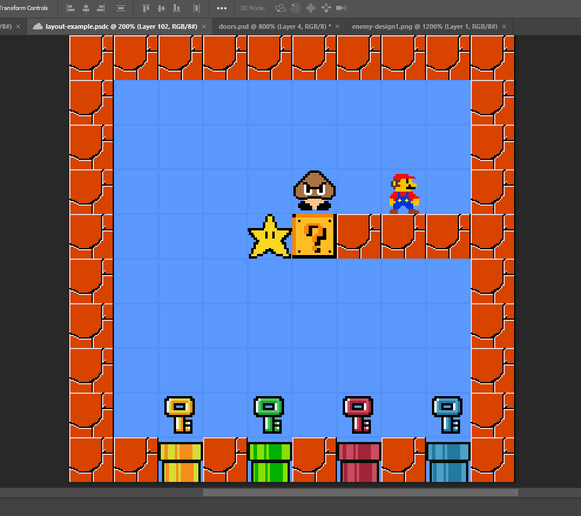

**How to play !**

1. Open the group project onto your IDE of choice (Eclipse for marking)
2. If using Eclipse, use the Repositories view to clone the project into the workspace.
3. Run the java application from App.Main()
4. Start a new game !

**For Persistancy:**

To save the game

Note: 

To test the "Save Game" you need to be playing one(have alrady started playing the game)
1. Click "Level" in the top bar of the game window.
2. Then click save Game on the drop down option.

To load saved game from Main menu.
1. click the "LOAD GAME" button on the screen.
2. Navigate to Saved Games (or desired directory).
3. Choose Saved Game with .xml extension and click open button.
4. This will Open a Game from previously saved point.

To load saved game while another game/level
1. Click "Level" in the top bar of the game window.
2. Then click Load Game on the drop down option.
3. Navigate to Saved Games (or desired directory).
4. Choose Saved Game with .xml extension and click open button.
5. This will Open a Game from previously saved point.

**For Recorder:**
1. Start a new game and play
2. When you want to save the record click the "Save Level Replay" button located in the "Level" button drop down
3. The save will be added to the /saves directory and you can check that it is the save you just did by the date/time label
4. Click "go to main menu" and click on "Load Replay" and open the file of your save
5. The replay will play as normal but you can control the speed/points via the buttons on the right hand side of the GUI screen :)
Done !

